## Part 1. Установка ОС
1. Узнай версию Ubuntu, выполнив команду
```
cat /etc/issue
```
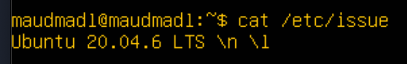
## Part 2. Создание пользователя
1. Создай пользователя, отличного от созданного при установке. Пользователь должен быть добавлен в группу ```adm```.

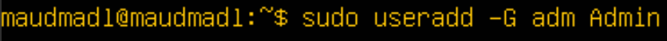
2. Новый пользователь должен быть в выводе команды
```cat /etc/passwd```


## Part 3. Настройка сети ОС
1. Задать название машины вида user-1


После выполнения команды выше нужно сделать ```reboot```

2. Установи временную зону, соответствующую твоему текущему местоположению


3. Выведи названия сетевых интерфейсов с помощью консольной команды.

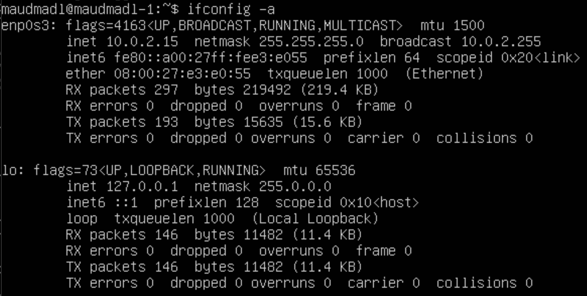

4. Loopback - это интерфейс, ведущий в никуда, то есть, действует только внутри устройства - далее устройства пакеты данных не идут.
Запросы, отправленные на него, приходят в ответ только от него. Вход на локальный сервер - 127.0.0.1

5. Используя консольную команду получить ip-адрес устройства, на котором ты работаешь, от DHCP-сервера

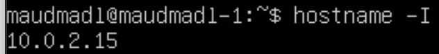

6. Dynamic Host Configuration Protocol (DHCP) — протокол прикладного уровня модели TCP/IP, служит для назначения IP-адреса клиенту. Это следует из его названия — Dynamic Host Configuration Protocol.

7. Определи и выведи на экран внешний ip-адрес шлюза (ip) и внтуренний IP-адрес шлюза, он же ip-адрес по умолчанию (gw).

* внешний ip-адрес шлюза (ip):


* внутренний ip-адрес шлюза (ip):
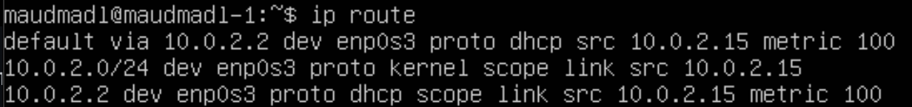

8. Задай статичные (заданные вручную, а не полученные от DHCP сервера) настройки ip, gw, dns (используй публичный DNS серверы, например 1.1.1.1 или 8.8.8.8).

```sudo vim /etc/netplan/00-installer-config.yaml```
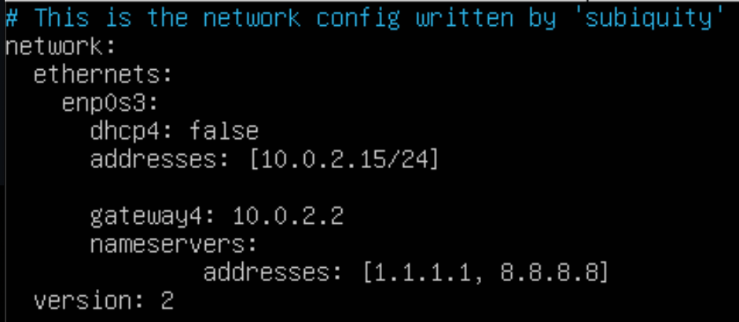

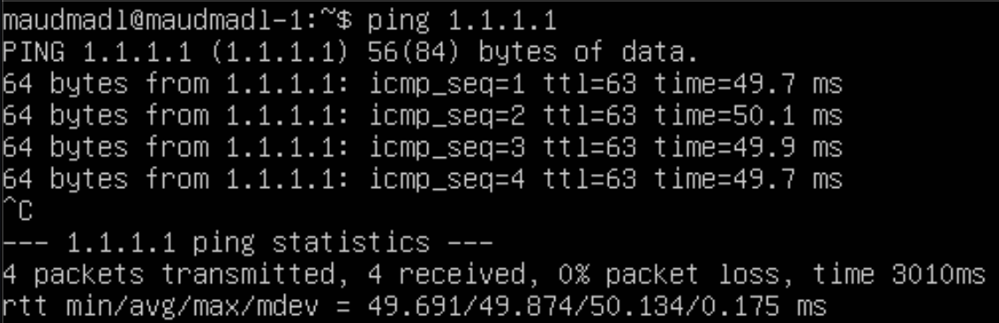


## Part 4. Обновление ОС
1. Обнови системные пакеты до последней на момент выполнения задания версии.


после этого вводим:
```sudo apt upgrade```
## Part 5. Использование команды sudo
1. Разреши пользователю, созданному в Part 2,выполнять команду sudo.
2. Команда ```sudo``` используется для выполнения команд, которые доступны только администратору. В случае ввода данной команды нужно ввести также пароль, чтобы избежать вмешательства в систему непрошенному пользователю.
3. 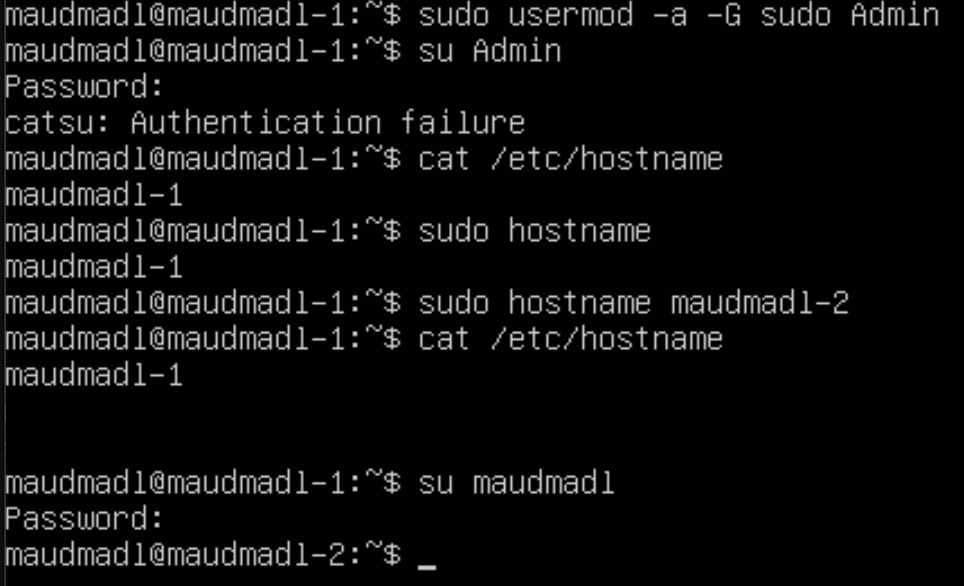
## Part 6. Установка и настройка службы времени
1. Выведи время часового пояса, в котором ты сейчас находишься.
2. 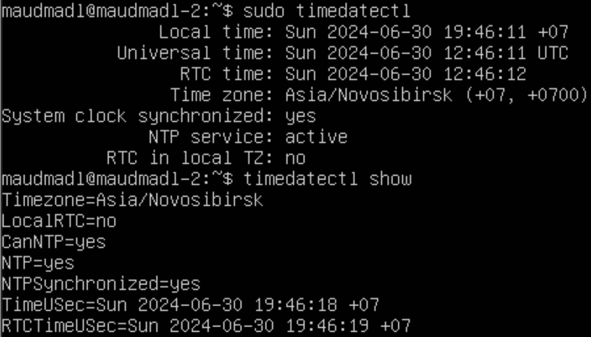
## Part 7. Установка и использование текстовых редакторов
1. Установи текстовые редакторы VIM (+ любые два по желанию NANO, MCEDIT, JOE и т.д.)

```sudo apt install vim```

```sudo apt install nano```

```sudo apt install mcedit```

2. Используя каждый из трех выбранных редакторов, создай файл test_X.txt, где X -- название редактора, в котором создан файл. Напиши в нём свой никнейм, закрой файл с сохранением изменений.

__MCEDIT__
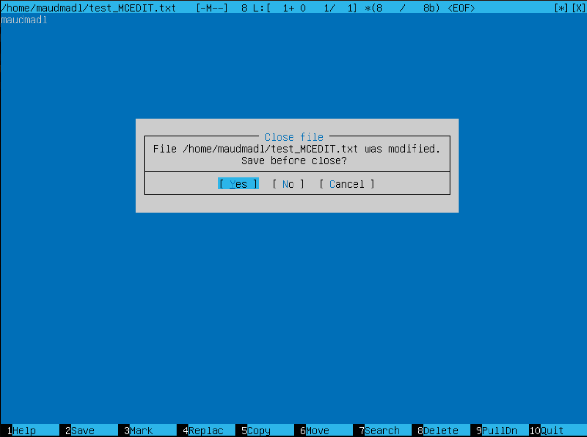

__VIM__


__NANO__


3. Используя каждый из трех выбранных редакторов, открой файл на редактирование, отредактируй файл, заменив никнейм на строку «21 School 21», закрой файл без сохранения изменений.

__MCEDIT__


__VIM__


__NANO__


4. Используя каждый из трех выбранных редакторов, отредактируй файл ещё раз (по аналогии с предыдущим пунктом), а затем освой функции поиска по содержимому файла (слово) и замены слова на любое другое.

__MCEDIT__

4.1 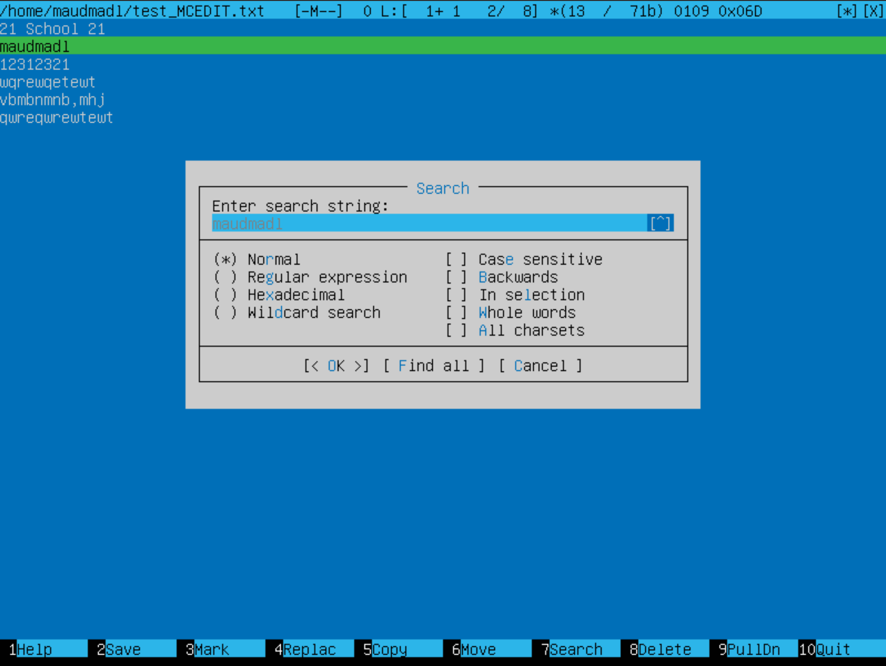
4.2 
4.3 

* mcedit test_MCEDIT.txt
* Exit with Save: F2+F10
* Exit with unSave: F10
* Search: F7 + text, which searched + ok
* Replace: F4 + word for replace -> word replaced + replace

__VIM__

4.1 
4.2 
4.3 

* vim test_VIM.txt
* Exit with Save: :wq
* Exit with unSave: :q
* Search: /text, which search
* Replace: : s/text, which replaced/ text replaced
* Edit Mode: i

__NANO__

4.1 
4.2 
4.3 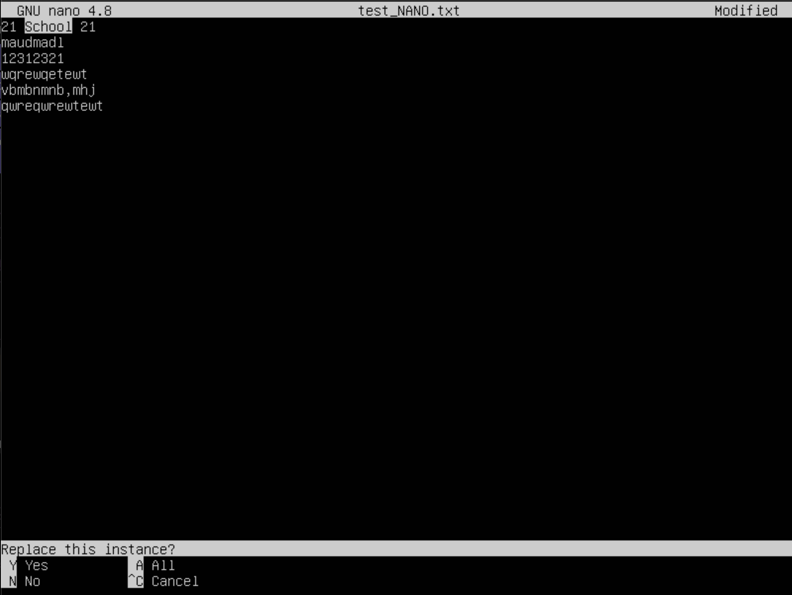
4.4 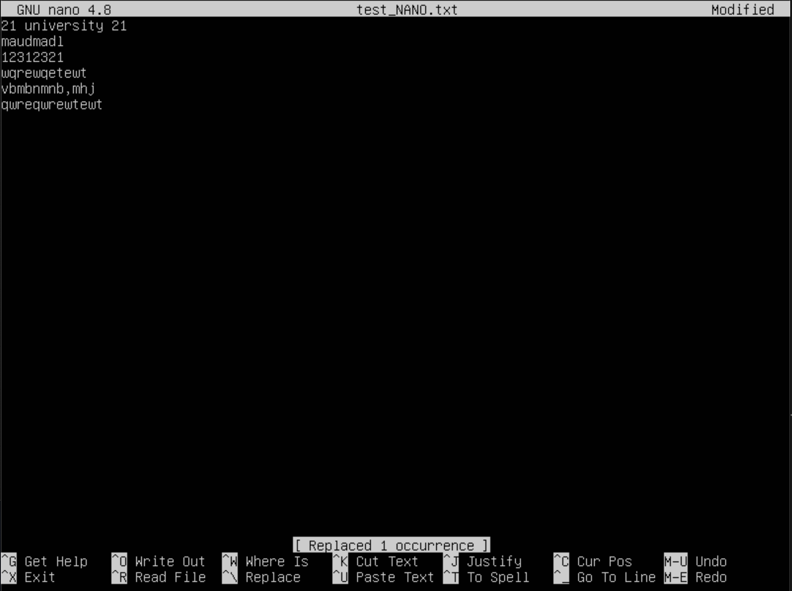

* nano test_NANO.txt
* Exit with Save: ctrl+x -> y -> enter
* Exit with unSave: ctrl+x -> n
* Search: ctrl+w -> enter (alt+w for next word, ctrl+c for stop search)
* Replace: ctrl+\ ->  word for replace + enter -> word replaced
## Part 8. Установка и базовая настройка сервиса SSHD
1. Установи службу SSHd.


После этого необходимо ввести команду:
```sudo apt install openssh-server```

2. Добавь автостарт службы при загрузке системы.
```sudo systemctl enable ssh```


3. Перенастрой службу SSHd на порт 2022 - ```sudo nano /etc/ssh/sshd_config```
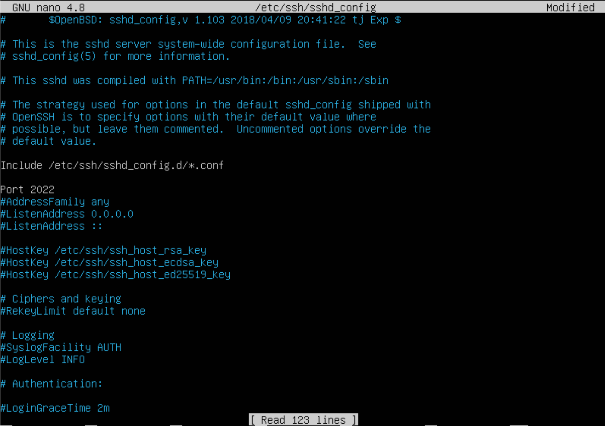
```systemctl restart sshd```

4. Используя команду ps, покажи наличие процесса sshd. Для этого к команде нужно подобрать ключи.


* ```ps``` (показывает запущенные процессы, выполняемые пользователем в окне терминала);
* ```ps -e``` или ```ps -A``` (Чтобы просмотреть все запущенные процессы);
* ```ps -d``` (Чтобы показать все процессы, кроме лидеров сессии);
* ```ps -d -N``` (можно инвертировать вывод с помощью переключателя -N. Например, если хочу вывести только лидеров сеансов)
* ```ps T``` (увидеть только процессы, связанные с этим терминалом);
* ```ps r``` (просмотреть все работающие (running) процессы);
* ```ps -p 'pid'``` (если вы знаете идентификатор процесса PID, вы можете просто использовать следующую команду, для вывода процесса с этим 'pid');
* ```ps -p 'pid1' 'pid2'```
* ```ps U 'userlist'``` (найти все процессы, выполняемые конкретным пользователем);
* ```ps -ef``` (получить полный список); 

5. Перезагрузи систему.
```reboot```

__NETSTAT__

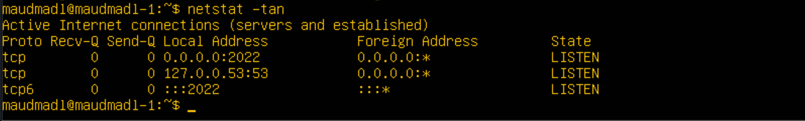

* ```-t (--tcp)``` отображает соедниеня только по tcp
* ```-a (--all)``` вывод всех активных подключений TCP
* ```-n (--numeric)``` вывод активных подключений TCP с отображением адресов и номеров портов в числовом формате
* ```Proto```: Название протокола (протокол TCP или протокол UDP);
* ```recv-Q```: очередь получения сети
* ```send-Q```: Сетевая очередь отправки
* ```Local Address``` адрес локального компьтера и используемы номер порта
* ```Foreign Address``` адрес и номер удаленного компьтера к которомц подключен сокет
* State состояние сокета
```0.0.0.0``` означает IP-адрес локальной машины
## Part 9. Установка и использование утилит top, htop
1. Установи и запусти утилиты top и htop.

По выводу команды top определи и напиши в отчёте:
* uptime - 42 min
* количество авторизованных пользователей: 1
* общую загрузку системы: 0.00, 0.00, 0.00
* общее количество процессов: 94
* загрузку cpu: 0.0%
* загрузку памяти: 147.9/479.8
* pid процесса занимающего больше всего памяти: 664
* pid процесса, занимающего больше всего процессорного времени: 1

2. В отчёт вставь скрин с выводом команды htop:

* отсортированному по PID
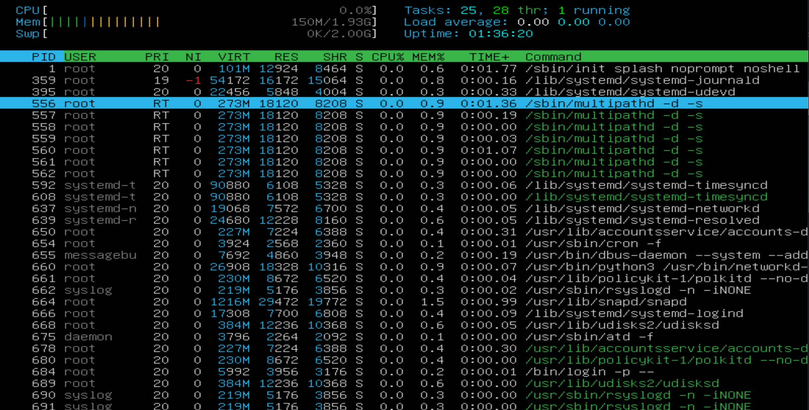

PERCENT_CPU
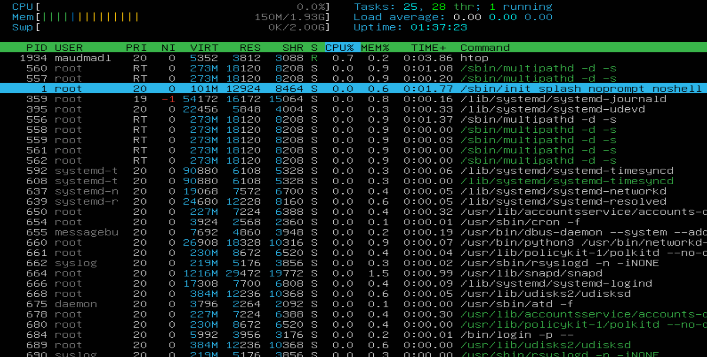

PERCENT_MEM


TIME
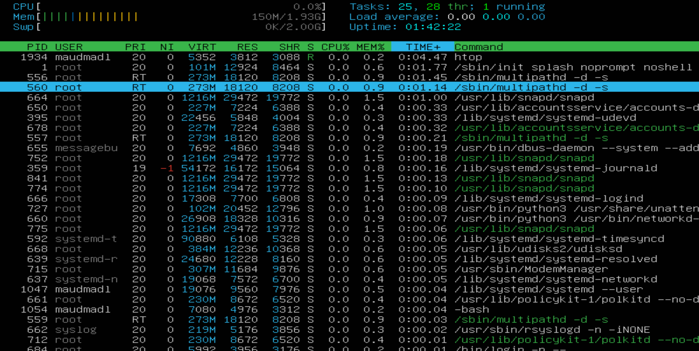

* отфильтрованному для процесса sshd
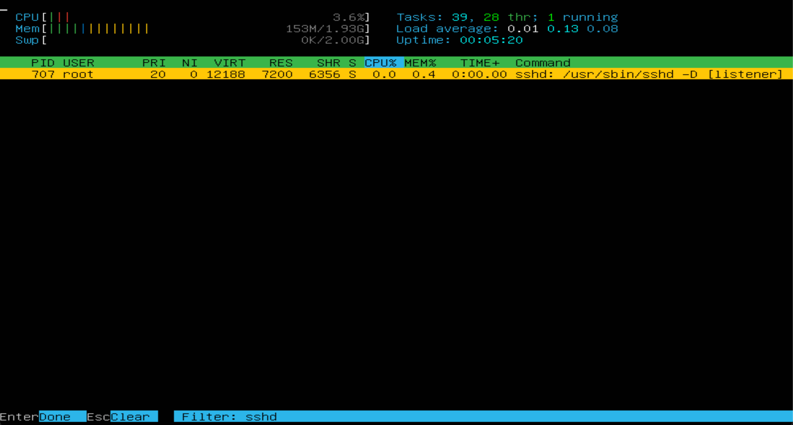

* с процессом syslog, найденным, используя поиск


* с добавленным выводом hostname, clock и uptime

## Part 10. Использование утилиты fdisk
1. Запусти команду ```fdisk -l```.


* название жесткого диска - VBOX HARDDISK;
* размер - 25 GiB;
* количество секторов - 52428800;
* размер swap - 2 GiB. 
## Part 11. Использование утилиты df
1. Запусти команду ```df```/```df -Th```.


2. В отчёте напиши для корневого раздела (/):

* размер раздела: 11758760
* размер занятого пространства: 962696
* размер свободного пространства: 6243476
* процент использования: 44%

Определи и напиши в отчёт единицу измерения в выводе: килобайты

3. В отчёте напиши для корневого раздела (/):

* размер раздела: 12G
* размер занятого пространства: 4.7G
* размер свободного пространства: 6.OG
* процент использования: 44%

Определи и напиши в отчёт тип файловой системы для раздела: ext4
## Part 12. Использование утилиты du
Запусти команду ```du```
1. Выведи размер папок /home, /var, /var/log (в байтах)
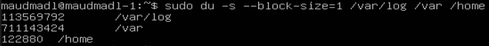

2. Выведи размер папок /home, /var, /var/log (в человекочитаемом виде)


3. Выведи размер всего содержимого в /var/log (не общее, а каждого вложенного элемента, используя *)

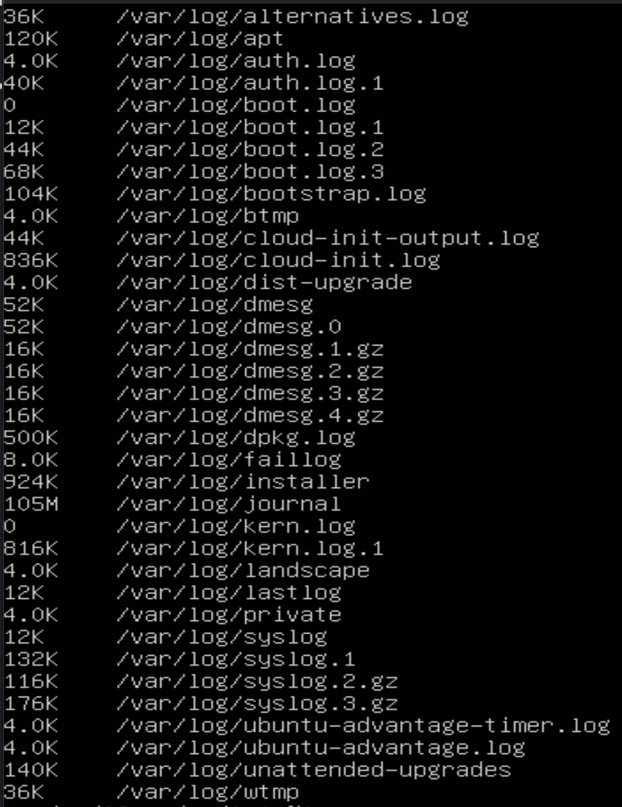
## Part 13. Установка и использование утилиты ncdu
1. Установи утилиту ncdu
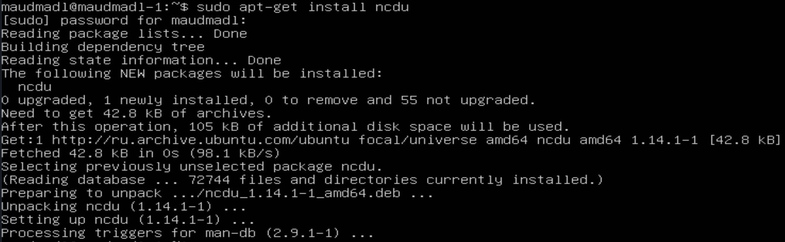

2. Выведи размер папок:
/home


/var


/var/log
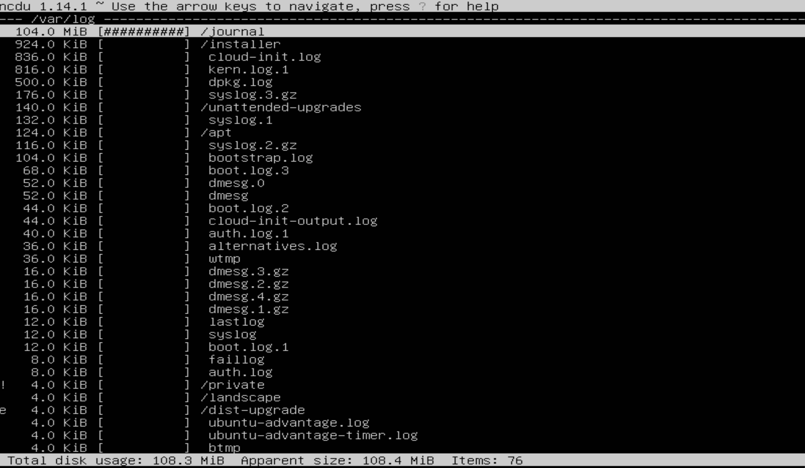
## Part 14. Работа с системными журналами
Открой для просмотра:

```/var/log/dmesg```

```/var/log/syslog```

```/var/log/auth.log```

1. Напиши в отчёте время последней успешной авторизации, имя пользователя и метод входа в систему (17:49:05; maudmadl-1 Started Login Service);

2. Перезапусти службу SSHd:

```sudo systemctl restart ssh```

3. Вставь в отчёт скрин с сообщением о рестарте службы (искать в логах).

## Part 15. Использование планировщика заданий CRON

1. Используя планировщик заданий, запусти команду uptime через каждые 2 минуты.
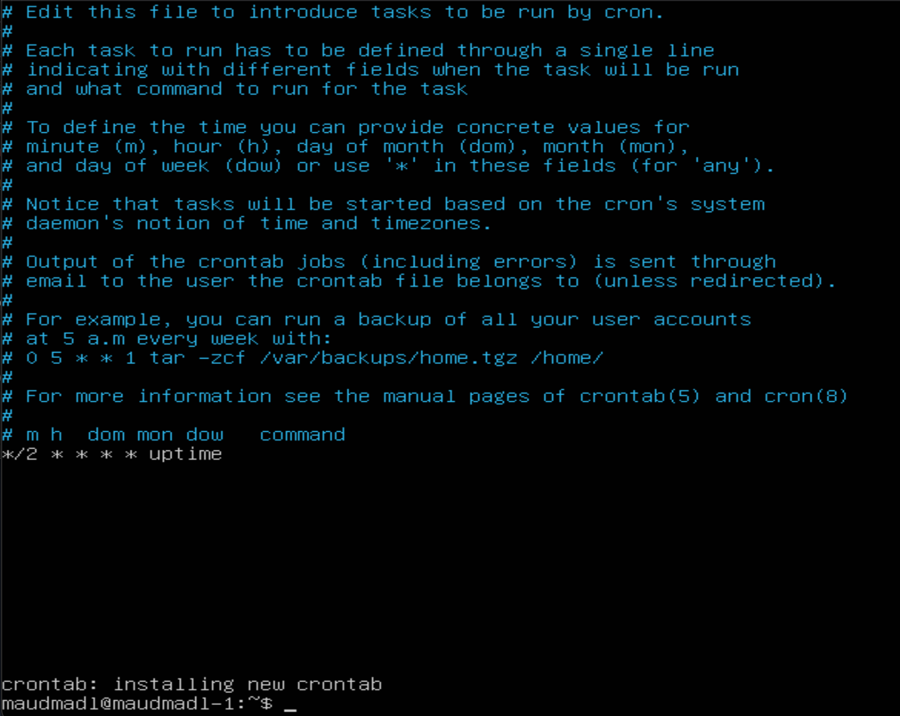

2. 
* Найди в системных журналах строчки (минимум две в заданном временном диапазоне) о выполнении;
* Выведи на экран список текущих заданий для CRON;

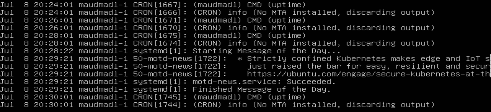

3. Удали все задания из планировщика заданий.
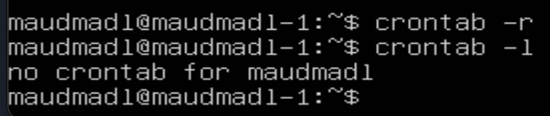