## Part 1. Инструмент ipcalc
### 1.1. Сети и маски
Определи и запиши в отчёт:
1) Адрес сети *192.167.38.54/13*


2) Перевод маски 255.255.255.0 в префиксную и двоичную запись, /15 в обычную и двоичную, 11111111.11111111.11111111.11110000 в обычную и префиксную


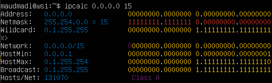


3) Минимальный и максимальный хост в сети 12.167.38.4 при масках: /8, 11111111.11111111.00000000.00000000, 255.255.254.0 и /4


### 1.2. localhost
Определи и запиши в отчёт, можно ли обратиться к приложению, работающему на localhost, со следующими IP:
194.34.23.100 - нельзя
127.0.0.2 - можно
127.1.0.1 - можно
128.0.0.1 - нельзя


### 1.3. Диапазоны и сегменты сетей
Определи и запиши в отчёт:
1) Какие из перечисленных IP можно использовать в качестве публичного, а какие только в качестве частных:

Приватные - 10.0.0.45, 192.168.4.2, 172.20.250.4, 172.16.255.255, 10.10.10.10


Публичные - 134.43.0.2, 172.0.2.1, 192.172.0.1,172.68.0.2, 192.169.168.1


2) Какие из перечисленных IP адресов шлюза возможны у сети 10.10.0.0/18:


Не возможны: 10.0.0.1, 10.10.100.1
Возможны: 10.10.0.2, 10.10.10.10, 10.10.1.255

## Part 2. Статическая маршрутизация между двумя машинами

Подними две виртуальные машины (далее -- ws1 и ws2).

С помощью команды ip a посмотри существующие сетевые интерфейсы.

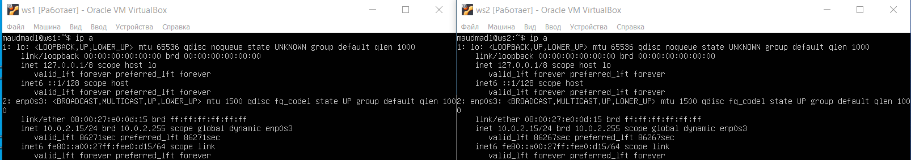

Опиши сетевой интерфейс, соответствующий внутренней сети, на обеих машинах и задать следующие адреса и маски: ws1 - 192.168.100.10, маска /16, ws2 - 172.24.116.8, маска /12.

1. lo или loopback (локальная петля). Служит для подключения по сети к этому же компьютеру и не требует дополнительной настройки;

```
* ws1: 127.0.0.1/8;
* ws2: 127.0.0.1/8;
```

2. enp0s3 - первый адаптер, работающий в NAT режиме
```
* ws1: 10.0.2.15/24;
* ws2: 10.0.2.15/24.
```

Для того, чтобы задать адреса и маски, нужно выполнить 
```
sudo vim /etc/netplan/00-installer-config.yaml
```


Выполни команду ```netplan apply``` для перезапуска сервиса сети.


### 2.1. Добавление статического маршрута вручную


Добавь статический маршрут от одной машины до другой и обратно при помощи команды вида ```ip r add```.

Пропингуй соединение между машинами.


### 2.2. Добавление статического маршрута с сохранением

Перезапусти машины.

Добавь статический маршрут от одной машины до другой с помощью файла /etc/netplan/00-installer-config.yaml.


Пропингуй соединение между машинами.

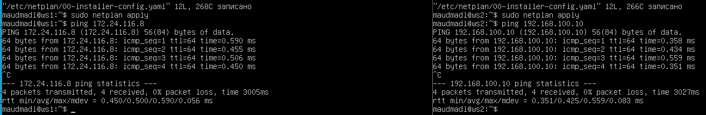

## Part 3. Утилита iperf3

### 3.1. Скорость соединения

Переведи и запиши в отчёт: 8 Mbps в MB/s, 100 MB/s в Kbps, 1 Gbps в Mbps.

* 8 MB/s - это 1 MB/s 
* 100 MB/s - это 800000 KB/s 
* 1 GB/s - это 1000 MB/s

### 3.2. Утилита iperf3

Измерь скорость соединения между ws1 и ws2.


## Part 4. Сетевой экран
### 4.1. Утилита iptables

Создай файл /etc/firewall.sh, имитирующий фаерволл, на ws1 и ws2:
```
#!/bin/sh

# Удаление всех правил в таблице «filter» (по-умолчанию).
iptables -F
iptables -X
```
Нужно добавить в файл подряд следующие правила:

1) На ws1 примени стратегию, когда в начале пишется запрещающее правило, а в конце пишется разрешающее правило (это касается пунктов 4 и 5).

2) На ws2 примени стратегию, когда в начале пишется разрешающее правило, а в конце пишется запрещающее правило (это касается пунктов 4 и 5).

3) Открой на машинах доступ для порта 22 (ssh) и порта 80 (http).

4) Запрети echo reply (машина не должна «пинговаться», т.е. должна быть блокировка на OUTPUT).

5) Разреши echo reply (машина должна «пинговаться»).

В отчёт помести скрины с содержанием файла /etc/firewall для каждой машины.


Запусти файлы на обеих машинах командами ```chmod +x /etc/firewall.sh``` и ```/etc/firewall.sh```.

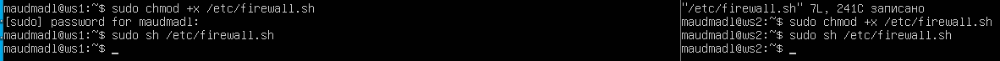

Разница между стратегиями заключается в том, что в первом файле первым подходящим правилом для пакета является запрет, а во втором - разрешение. Применяется только первое подходящее правило, остальные игнорируются.

### 4.2. Утилита nmap

Командой ping найди машину, которая не «пингуется», после чего утилитой nmap покажи, что хост машины запущен.


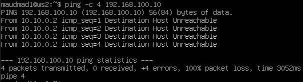

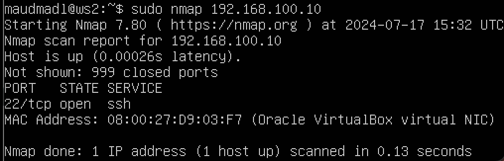

ws1 - OUTPUT для пакетов на ping-reply DROP - не работает т.е. пакеты отправляет, но не принемает.
ws2 - OUTPUT для пакетов на ping-reply ACCEPT - работает.

## Part 5. Статическая маршрутизация сети


Подними пять виртуальных машин (3 рабочие станции (ws11, ws21, ws22) и 2 роутера (r1, r2)).

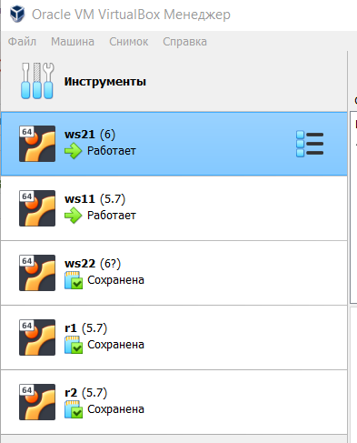

### 5.1. Настройка адресов машин

Настрой конфигурации машин в etc/netplan/00-installer-config.yaml согласно сети на рисунке.

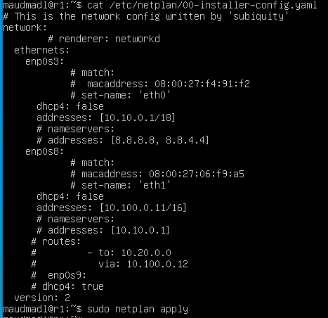


Перезапусти сервис сети. Если ошибок нет, то командой ip -4 a проверь, что адрес машины задан верно. Также пропингуй ws22 с ws21. Аналогично пропингуй r1 с ws11.

ip -4 a для всех устройств

* 2 роутера (r1, r2):


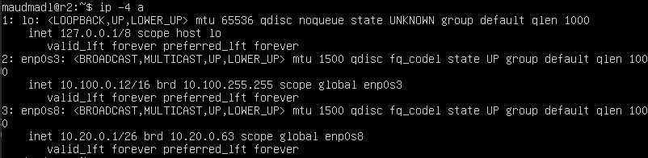

* 3 рабочие станции (ws11, ws22, ws21):


* Пропингуйте ping ws22 с ws21 и ping r1 с ws11:


### 5.2. Включение переадресации IP-адресов

Для включения переадресации IP, выполни команду на роутерах:
```sysctl -w net.ipv4.ip_forward=1```
_При таком подходе переадресация не будет работать после перезагрузки системы._


Открой файл /etc/sysctl.conf и добавь в него следующую строку:
```net.ipv4.ip_forward = 1```
_При использовании этого подхода, IP-переадресация включена на постоянной основе._


### 5.3. Установка маршрута по-умолчанию

Настрой маршрут по-умолчанию (шлюз) для рабочих станций. Для этого добавь ```default``` перед IP роутера в файле конфигураций.

Вызови ip r и покажи таблицы с маршрутами на обоих роутерах. Пример таблицы на r1 (в скринах прилагается шлюз по-умолчанию и ip r):

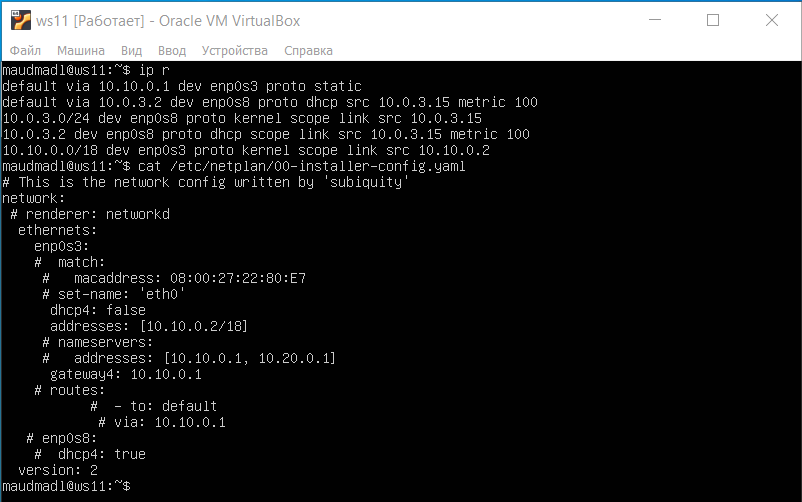


Пропингуй с ws11 роутер r2 и покажи на r2, что пинг доходит. Для этого используй команду ```tcpdump -tn -i eth0```:


### 5.4. Добавление статических маршрутов

Добавь в роутеры r1 и r2 статические маршруты в файле конфигураций. Пример для r1 маршрута в сетку 10.20.0.0/26:


Вызови ip r и покажи таблицы с маршрутами на обоих роутерах. Пример таблицы на r1:


Запусти команды на ws11:
```ip r list 10.10.0.0/[маска сети]``` и ```ip r list 0.0.0.0/0```


Для адреса 10.10.0.0/[порт сети] был выбран маршрут, отличный от 0.0.0.0/0, потому что порт /18 описывает маршрут к сети точнее, в отличие от порта /0.

### 5.5. Построение списка маршрутизаторов

Запусти на r1 команду дампа:

```tcpdump -tnv -i eth0```

При помощи утилиты traceroute построй список маршрутизаторов на пути от ws11 до ws21.


Хост, с которого выполняется трассировка, отправляет пакеты на адрес назначения с разными показателями "времени жизни" TTL, начиная с 1 и постепенно его увеличивая. Каждый хост на пути к назначению отправляет пакет ICMP time exceeded in-transit, показывая, что пакет ещё не дошёл до адреса назначения. Адрес отправителя в данном пакете фиксируется в трассировке, как промежуточное звено на пути к адресу назначения. По умолчанию запросы от хоста-источника отправляются с помощью "проб"-пакетов (probes) по протоколу UDP, но с помощью ключей -I и -T можно заменить протокол на ICMP или TCP соответственно.

### 5.6. Использование протокола ICMP при маршрутизации

Запусти на r1 перехват сетевого трафика, проходящего через eth0 с помощью команды:
```tcpdump -n -i eth0 icmp```

Пропингуй с ws11 несуществующий IP (например, 10.30.0.111) с помощью команды:
```ping -c 1 10.30.0.111```


## Part 6. Динамическая настройка IP с помощью DHCP

В данном задании используются виртуальные машины из Части 5.

Для r2 настрой в файле /etc/dhcp/dhcpd.conf конфигурацию службы DHCP:

1) Укажи адрес маршрутизатора по-умолчанию, DNS-сервер и адрес внутренней сети. Пример файла для r2:


2) В файле resolv.conf пропиши nameserver 8.8.8.8.


Перезагрузи службу DHCP командой ```systemctl restart isc-dhcp-server```. Машину ws21 перезагрузи при помощи reboot и через ip a покажи, что она получила адрес. Также пропингуй ws22 с ws21.


Укажи MAC адрес у ws11, для этого в ```etc/netplan/00-installer-config.yaml надо добавить строки: macaddress: 10:10:10:10:10:BA, dhcp4: true```.


Для r1 настрой аналогично r2, но сделай выдачу адресов с жесткой привязкой к MAC-адресу (ws11). Проведи аналогичные тесты.


Для r1 настроить аналогично r2, в файле ```resolv.conf``` прописать nameserver 8.8.8.8.


Перезагрузить службу DHCP командой ```systemctl restart isc-dhcp-server```. Машину ws11 перезагрузить при помощи reboot и через ip a показать, что она получила адрес.

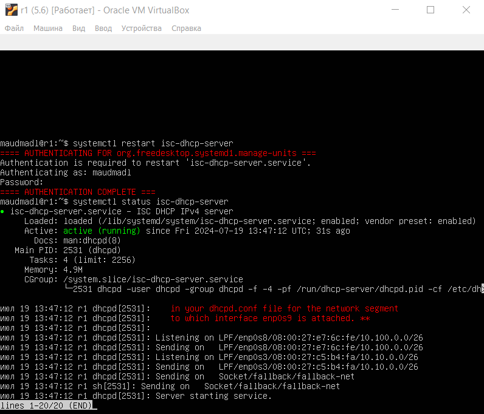


Запроси с ws21 обновление ip адреса.


```systemctl restart isc-dhcp-server``` - эта команда перезапускает сервис DHCP-сервера, который обычно называется isc-dhcp-server. Перезапуск сервиса может потребоваться после внесения изменений в конфигурацию или при возникновении проблем с работой сервера.

```systemctl status isc-dhcp-server``` - эта команда отображает статус текущего состояния DHCP-сервера. Она показывает, запущен ли сервис, работает ли он в данный момент, и если нет, то почему. Эта команда может быть полезна для диагностики проблем с сервисом.

Функция ```ip a``` используется в командной строке Unix-подобных операционных систем для просмотра информации о сетевых интерфейсах и их настройках. Эта команда позволяет получить подробную информацию о каждом сетевом интерфейсе, включая его имя, MAC-адрес, IP-адрес и другие параметры настройки.

## Part 7. NAT

В файле /etc/apache2/ports.conf на ws22 и r1 измени строку Listen 80 на Listen 0.0.0.0:80, то есть сделай сервер Apache2 общедоступным.


Запусти веб-сервер Apache командой service apache2 start на ws22 и r1.

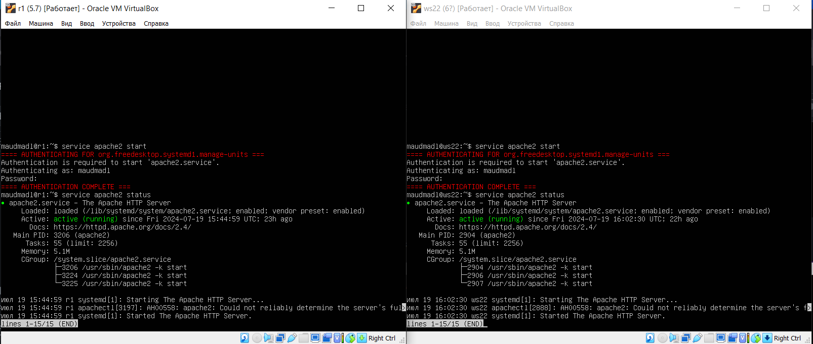

Добавь в фаервол, созданный по аналогии с фаерволом из Части 4, на r2 следующие правила:

1) Удаление правил в таблице filter - ```iptables -F```;

2) Удаление правил в таблице "NAT" - ```iptables -F -t nat```;

3) Отбрасывать все маршрутизируемые пакеты - ```iptables --policy FORWARD DROP```.

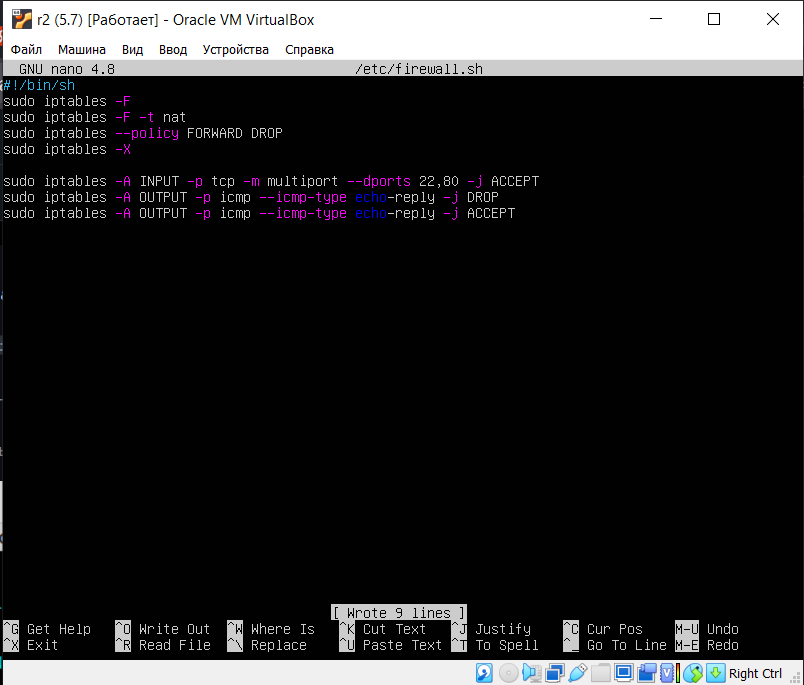


Запусти файл также, как в Части 4.

Проверить соединение между ws22 и r1 командой ping

При запуске файла с этими правилами, ws22 не должна "пинговаться" с r1


Добавь в файл ещё одно правило:

4) Разрешить маршрутизацию всех пакетов протокола ICMP.

Запусти файл также, как в Части 4.

Проверь соединение между ws22 и r1 командой ping.

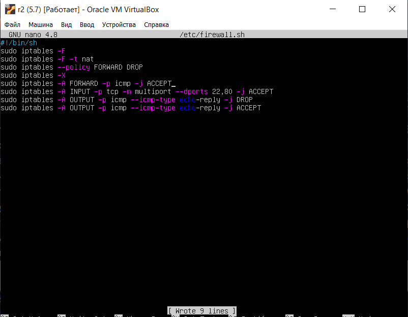

Добавь в файл ещё два правила:

5) Включи SNAT, а именно маскирование всех локальных ip из локальной сети, находящейся за r2 (по обозначениям из Части 5 - сеть 10.20.0.0).

6) Включи DNAT на 8080 порт машины r2 и добавить к веб-серверу Apache, запущенному на ws22, доступ извне сети.

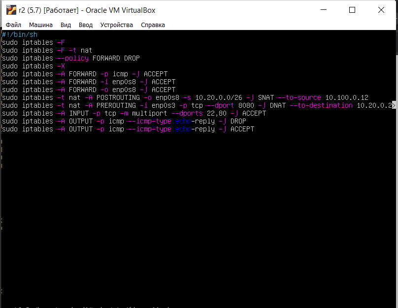

Проверь соединение по TCP для SNAT: для этого с ws22 подключиться к серверу Apache на r1 командой:
```telnet [адрес] [порт]```


Проверь соединение по TCP для DNAT: для этого с r1 подключиться к серверу Apache на ws22 командой telnet (обращаться по адресу r2 и порту 8080).


## Part 8. Дополнительно. Знакомство с SSH Tunnels

Запусти на r2 фаервол с правилами из Части 7.


Запусти веб-сервер Apache на ws22 только на localhost (то есть в файле /etc/apache2/ports.conf измени строку Listen 80 на Listen localhost:80).


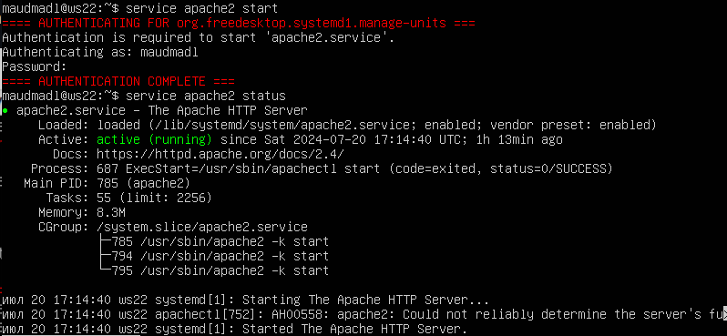

Воспользуйся Local TCP forwarding с ws21 до ws22, чтобы получить доступ к веб-серверу на ws22 с ws21.


Воспользуйся Remote TCP forwarding c ws11 до ws22, чтобы получить доступ к веб-серверу на ws22 с ws11.


Для проверки, сработало ли подключение в обоих предыдущих пунктах, перейди во второй терминал (например, клавишами Alt + F2) и выполни команду:

```telnet 127.0.0.1 [локальный порт]```


