# DO5_SimpleDocker-1 
## Part 1. Готовый докер

Возьмем официальный докер-образ с `nginx` и выкачаем его при помощи `docker pull`.  
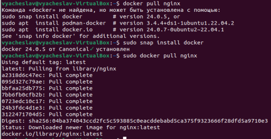

Проверим наличие докер-образа через `docker images`.  
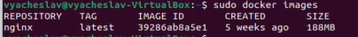

Запустим докер-образ через `docker run -d [image_id|repository]`.  
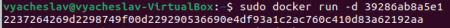

Проверим, что образ запустился через `docker ps`.  
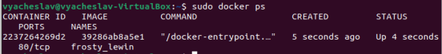

Посмотрим информацию о контейнере через `docker inspect [container_id|container_name]`.
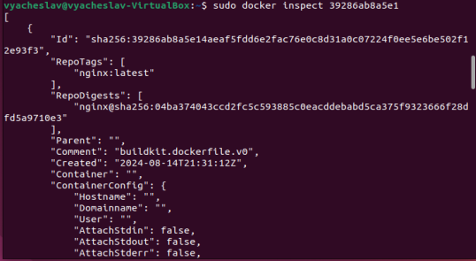  

По выводу команды определим `размер контейнера, список замапленных портов и ip контейнера`.  
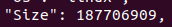  
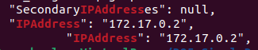  
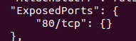  

Остановим докер образ через `docker stop [container_id|container_name]` и проверим, что образ остановился через 'docker ps'.  
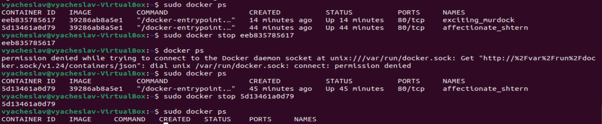  

Запустим докер с `портами 80 и 443` в контейнере, замапленными на такие же порты на локальной машине, через команду `run`.  
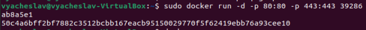  

Проверим, что в браузере по адресу `localhost:80` доступна стартовая страница `nginx`.
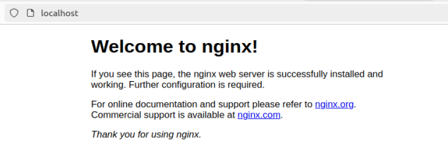    

Перезапустим докер контейнер через `docker restart [container_id|container_name]`.  

Проверим любым способом, что контейнер запустился.  
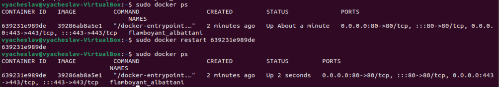  

## Part 2. Операции с контейнером

Прочтём конфигурационный файл `nginx.conf` внутри докер контейнера через команду `exec`.
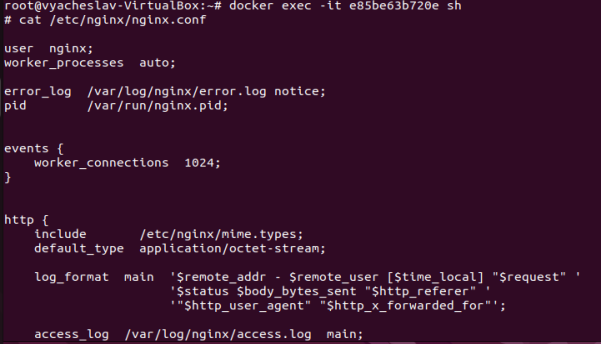

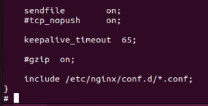

Создадим на локальной машине файл `nginx.conf`.  
Настройм в нем по пути `/status` отдачу страницы статуса сервера `nginx`.  

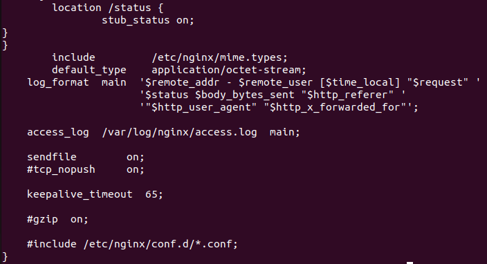

Скопируем созданный файл `nginx.conf` внутрь докер-образа через команду `docker cp`.  
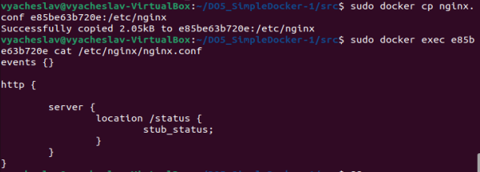  

Перезапустим `nginx` внутри докер-образа через команду `exec`.

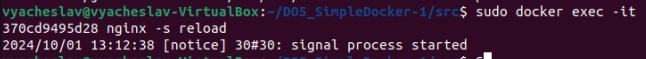  

Проверим, что по адресу `localhost:80/status` отдается страничка со статусом сервера `nginx`.  
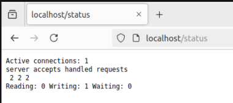  

Экспортируем контейнер в файл `container.tar` через команду `export`.

Остановим контейнер.  
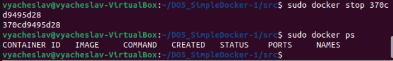  

Удалим образ через `docker rmi [image_id|repository]`, не удаляя перед этим контейнеры.
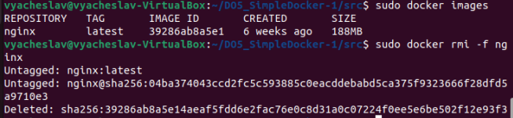  

Удалим остановленный контейнер.  
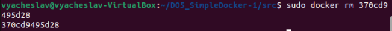  

Импортируем контейнер обратно через команду `import`.

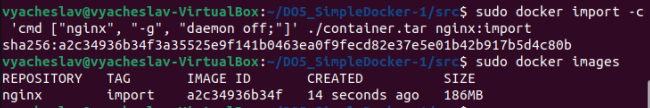  

Запустим импортированный контейнер.

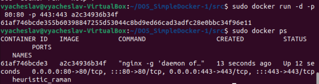  

Проверим, что по адресу `localhost:80/status` отдается страничка со статусом сервера `nginx`.  
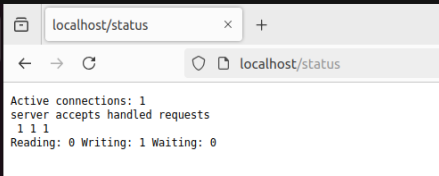  

## Part 3. Мини веб-сервер

Напишем `мини-сервер на C и FastCgi`, который будет возвращать простейшую страничку с надписью `Hello World!`.  
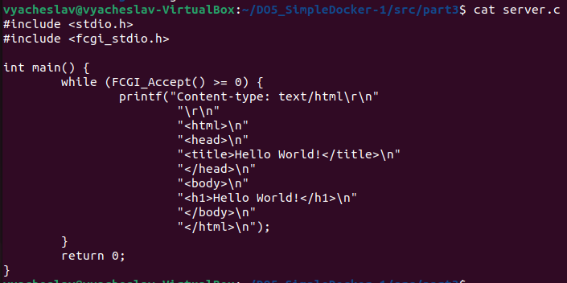  

Напишем свой `nginx.conf`, который будет проксировать все запросы с `81 порта` на `127.0.0.1:8080`.  
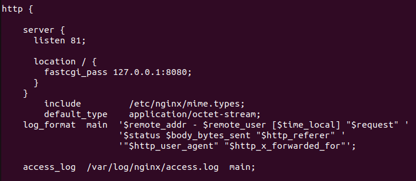  

Качаем образ `nginx`, запускаем контейнер, копируем файл `miniserver.c` и `nginx.conf`.  

Заходим в контейнер командой `docker exec -it [container_id] bash`, обновляемся, устанавливаем `gcc, spawn-fcgi, libfcgi-dev`.
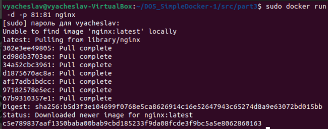  
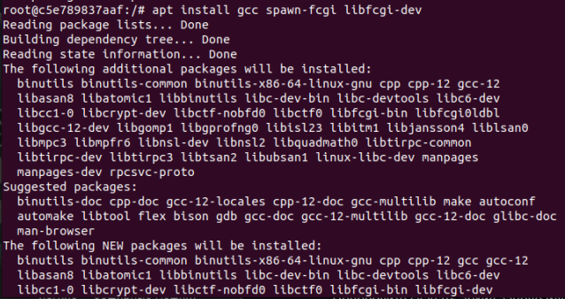  
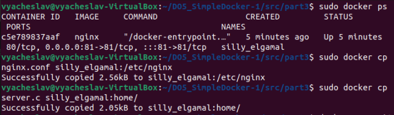  

Запустим написанный мини-сервер через `spawn-fcgi` на порту `8080`.  
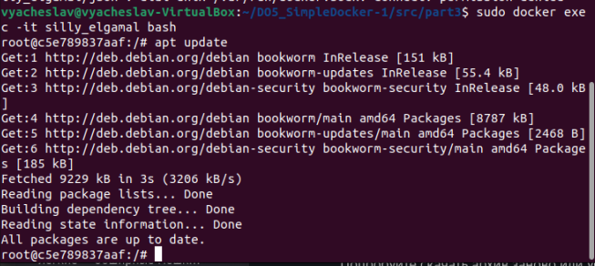  

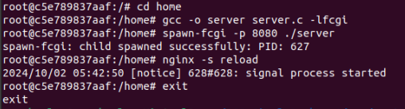  

Проверим, что в браузере по `localhost:81` отдается написанная нами страничка.   
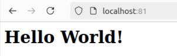  

Положим файл `nginx.conf` по пути `./nginx/nginx.conf` (это понадобится позже).  
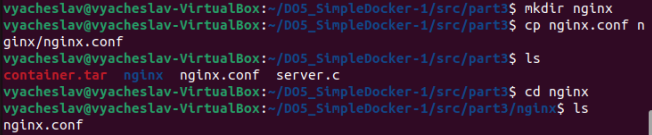  

## Part 4. Свой докер

Напишем свой докер-образ, который:

1) собирает исходники мини сервера на `FastCgi` из Части 3;
2) запускает его на `8080 порту`;
3) копирует внутрь образа написанный `./nginx/nginx.conf`;
4) запускает `nginx`.
nginx можно установить внутрь докера самостоятельно, а можно воспользоваться готовым образом с nginx'ом, как базовым.  
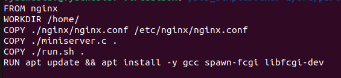  
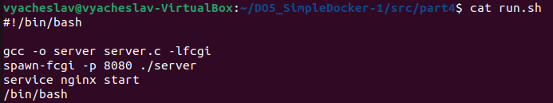  

Соберем написанный докер-образ через `docker build` при этом указав имя и тег.  
  

Проверим через `docker images`, что все собралось корректно.

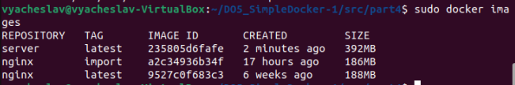  
Запустим собранный докер-образ `с маппингом 81 порта на 80 на локальной машине` и маппингом папки `./nginx` внутрь контейнера по адресу, где лежат конфигурационные файлы `nginx'а`.

Проверим, что по `localhost:80` доступна страничка написанного мини сервера.  
   
Проверим, что по `localhost:80/status` отдается страничка со статусом `nginx`.  
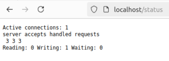   

## Part 5. Dockle

Сканируем образ из предыдущего задания через `dockle [image_id|repository]`.
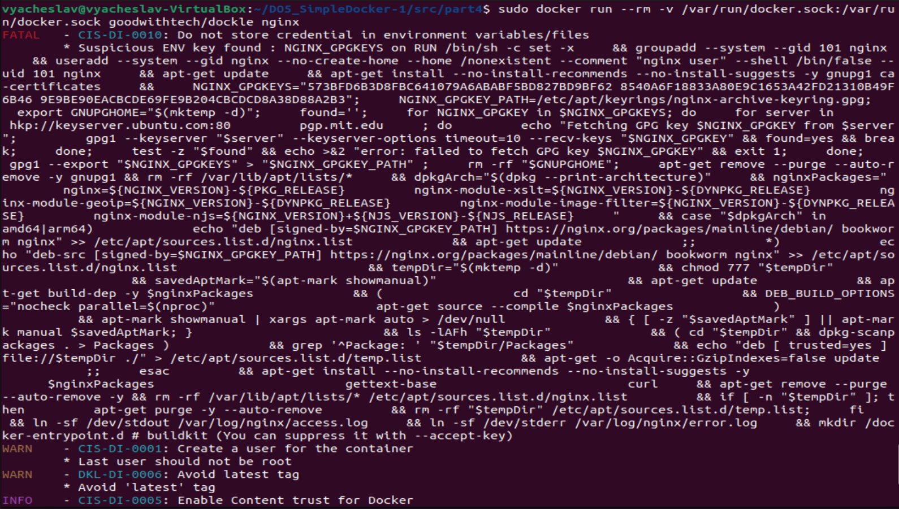  
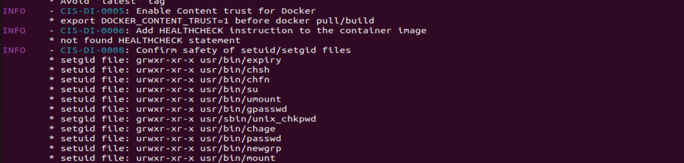  

Перепишем `dockerfile`, чтобы избавиться от ошибок.
С ошибкой `CIS-DI-0010` можно разобраться только сменой образа на `Alpine`.  
   

Запустим образ заново и обратим внимание, что ошибки `dockle` устранены.
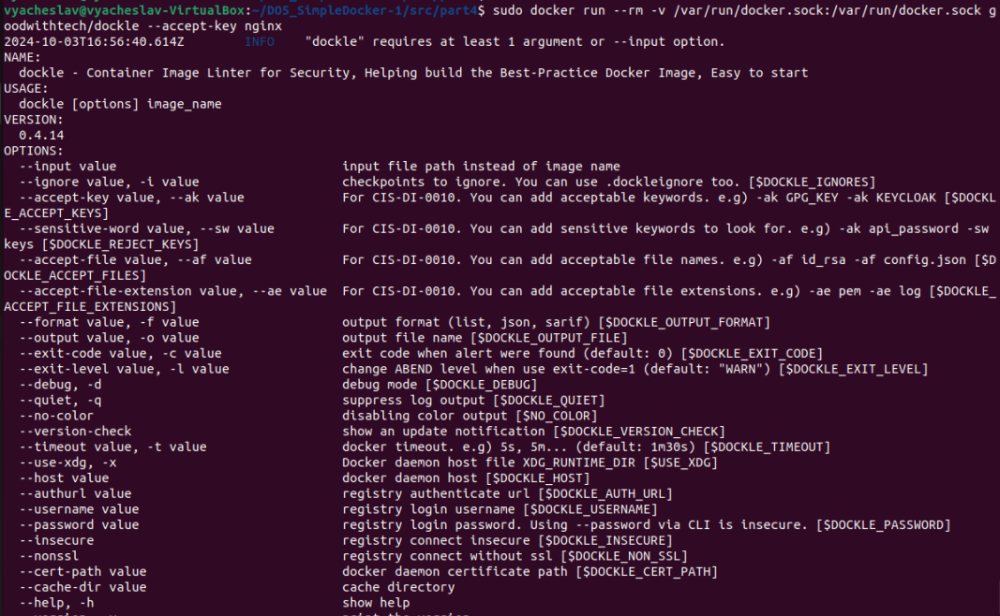    

## Part 6. Базовый Docker Compose

Напишем файл `docker-compose.yml`.   
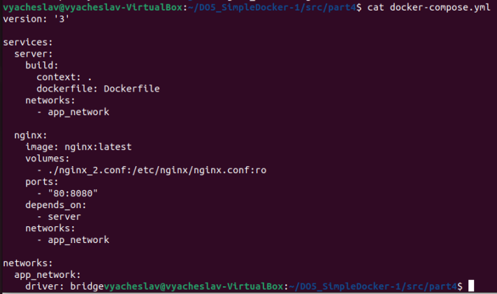  

Поднимем докер-контейнер с `nginx`, который будет проксировать все запросы с `8080 порта на 81 порт` первого контейнера.  
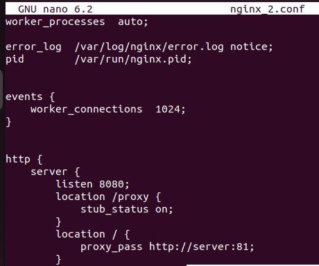  

Останови все запущенные контейнеры.

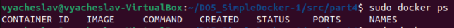

Собери и запусти проект с помощью команд docker-compose build и docker-compose up.  
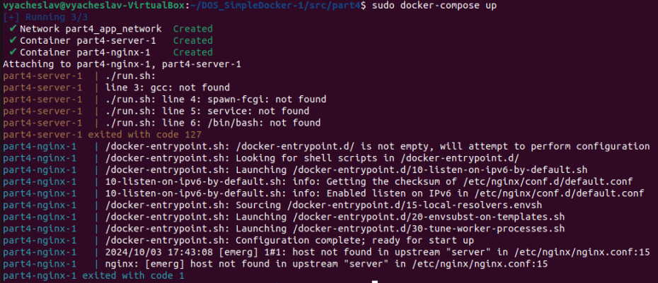  

Проверь, что в браузере по localhost:80 отдается написанная тобой страничка, как и ранее.  
 